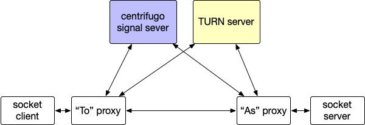

# webrtc-socket-proxy


Peer-to-peer TCP socket proxy using WebRTC, with [centrifugo](https://centrifugal.github.io/centrifugo/) as the signal server.

## Setup

* Install `webrtc-socket-proxy`

```
$ go get -u github.com/poga/webrtc-socket-proxy
```

* Setup [centrifugo](https://github.com/centrifugal/centrifugo/releases) with [example config](config.centrifugo.test.json).

## Usage

```
# the `As` proxy
$ webrtc-socket-proxy -signal=<SIGNAL_SERVER_ADDR> -secret=<SIGNAL_SERVER_SECRET> -as=<PEER_ID> -upstreamAddr=localhost:8000
# the `To` proxy
$ webrtc-socket-proxy -signal=<SIGNAL_SERVER_ADDR> -secret=<SIGNAL_SERVER_SECRET> -to=<PEER_ID> -listen=:4444
```

You can send data to your `<upstreamAddr>` via connecting to `:4444` now.

## Roadmap

- [ ] TURN server support
- [ ] Multiplex Connections. Currently we only support one connnection per proxy-pair

## License

The MIT License